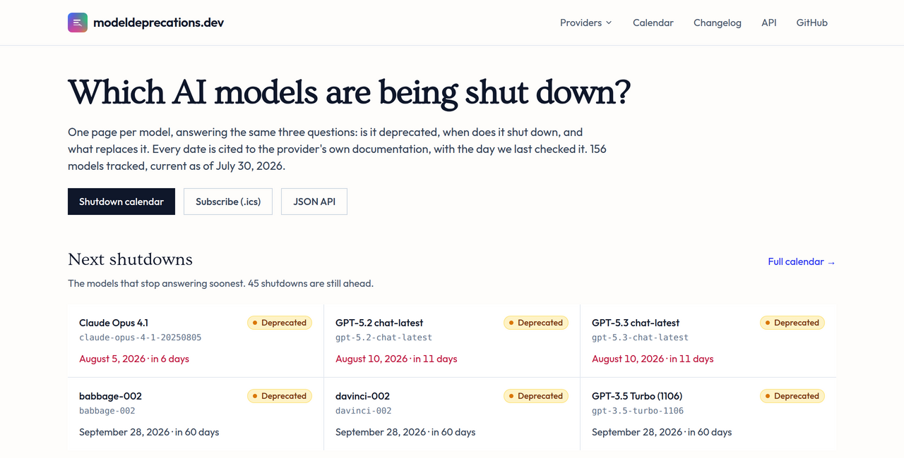

<div align="center">
  
</div>
<hr>

# modeldeprecations.dev

> An open, community-maintained catalog of AI model deprecations.

[](https://github.com/mnfst/modeldeprecations.dev/actions/workflows/ci.yml)
[](LICENSE)

One page per model, answering the same three questions: is it deprecated, when does it shut down, and what replaces it. OpenAI, Anthropic, Google, DeepSeek, Mistral, xAI, Cohere, Moonshot AI, MiniMax, Z.ai, Qwen, Amazon and Xiaomi MiMo. Every date is cited to the provider's own docs and stamped with the day we last checked it.

Browse it by provider ([`/openai`](https://modeldeprecations.dev/openai)), by lifecycle ([`/deprecated`](https://modeldeprecations.dev/deprecated), [`/retired`](https://modeldeprecations.dev/retired)) or by the year a model stops answering ([`/shutdowns/2026`](https://modeldeprecations.dev/shutdowns/2026)). How the sourcing works is on [`/about`](https://modeldeprecations.dev/about).

Sibling of [modelparams.dev](https://modelparams.dev), which catalogues the parameters each model accepts. We use both at [Manifest](https://manifest.build/).

## Badges

Put a model's status in your own README. Green while it works, amber once the provider announces it is going away, red once it stops answering.

```markdown

```

Status is recomputed against the build date, so the badge turns red on the day the shutdown actually lands. Nobody has to remember to edit a file.

## API

Prefer raw JSON?

```bash
curl https://modeldeprecations.dev/api/v1/models.json
curl https://modeldeprecations.dev/api/v1/models/openai/gpt-4-32k.json
curl https://modeldeprecations.dev/openai/gpt-4-32k.md   # the same page, as Markdown
```

Static files off the edge, CORS enabled, no key and no rate limit. Schema at `https://modeldeprecations.dev/api/v1/schema.json`. Ids are `provider/model`, and dated snapshots like `gpt-4-32k-0613` resolve as aliases of their canonical entry rather than duplicate records.

There is also a [shutdown calendar](https://modeldeprecations.dev/calendar.ics) you can subscribe to in your own calendar app, and a [changelog feed](https://modeldeprecations.dev/changelog.xml).

## For agents

`llms.txt` and `llms-full.txt` live at the site root, every model page is also served as Markdown (append `.md`), and the site exposes four [WebMCP](https://github.com/webmachinelearning/webmcp) tools in the browser: `check_model_deprecation`, `list_shutdowns`, `find_replacement` and `get_usage_guide`.

## Lifecycle

The three states use the same words the providers do.

| Status       | Meaning                                                        |
| ------------ | -------------------------------------------------------------- |
| `active`     | Still supported. No deprecation announced.                     |
| `deprecated` | The provider has announced it is going away. It still answers. |
| `retired`    | API access is gone. Requests fail.                             |

A model can be active and still carry a shutdown date. Anthropic publishes a "not sooner than" date, and Google publishes an earliest possible retirement date, for models that are current and fully supported. Those go in `earliest_shutdown_on` and render as a scheduled shutdown rather than a deprecation, because that is what the provider actually committed to. A firm date goes in `shutdown_on`.

## Adding a model

One YAML file per model under `models/<provider>/`, then open a PR. CI validates it against the schema.

```yaml
# yaml-language-server: $schema=https://modeldeprecations.dev/api/v1/schema.json
provider: openai
model: gpt-4-32k
name: GPT-4 32k
aliases: [gpt-4-32k-0613, gpt-4-32k-0314]
description: >-
  Two to four sentences on what it was, what it was known for, and why it went
  away. Never templated.
released_on: 2023-06-13
deprecated_on: 2024-06-06 # the provider announced it
shutdown_on: 2025-06-06 # API access removed
status: retired
replacements:
  - provider: openai
    model: gpt-4o
    recommended: true # the successor the provider itself names
    note: Migration hint, including any parameter differences.
sources:
  - url: https://developers.openai.com/api/docs/deprecations
    title: OpenAI API deprecations
    accessed: 2026-07-30
last_verified: 2026-07-30
```

**Never invent a date.** Every `deprecated_on`, `shutdown_on` and `earliest_shutdown_on` has to be verifiable at a URL you list in `sources`. If you cannot find the date, leave the field out and the page will say so honestly. A page that admits it has no shutdown date is useful; a page with a plausible wrong date is worse than nothing, because someone will plan a migration around it.

CI enforces that, and a second workflow guards against quieter regressions: deleting a page, dropping an alias that used to resolve, pulling sources out from under a date, or changing a date without moving `last_verified` forward. Maintainers can override it with the `allow-data-regression` label.

Sources are the provider's own deprecation pages. The four Gemini 1.x entries are the one exception: Google deleted those rows from its tables, so they also cite the community [`llm-model-deprecation`](https://github.com/techdevsynergy/llm-model-deprecation) registry, and the page says so. Where that registry and a provider page disagree, the provider page wins.

Found a wrong date? [File an issue](https://github.com/mnfst/modeldeprecations.dev/issues/new/choose) with the provider URL that proves it, or edit the YAML directly. There is a link to it on every model page. Full conventions are in [CONTRIBUTING.md](CONTRIBUTING.md).

## Local development

```bash
npm install
npm run dev          # http://localhost:3000, reloads on changes to models/ and views/
npm run build        # → dist/
npm run validate     # check every YAML
npm test
npm run check:deploy # crawl the deployed site: 404s, redirects, robots headers
```

`check:deploy` runs against production by default and asserts the things only the
edge can get wrong — that an unknown URL really 404s, that `/api` and the `.md`
twins send `noindex`, that `.html` and trailing slashes redirect to one canonical
address, and that the deployed build has not gone stale. Pass an origin to point
it at a preview deployment. It runs daily in CI, separately from the pull-request
checks, because a failure there is a deployment problem rather than a problem
with the branch.

Countdowns are a pure function of the build date, so the site redeploys on a
daily timer and the client re-derives each one from the reader's clock. See
[CONTRIBUTING.md](CONTRIBUTING.md#freshness).

## License

MIT. The data is free to use, including commercially.
